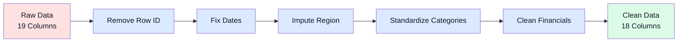

# Data Cleaning Documentation

*Superstore Sales: raw to analysis-ready.*

 

---

## 📊 Overview

Transformed raw Superstore sales data into a clean, analysis-ready dataset with complete coverage across all fields.

**At a glance**

| Item | Value |
|------|-------|
| Records | 12,617 |
| Columns | 18 |
| Period | 2014-2017 |
| Completeness | 100% |
| Output file | Cleaned_Dataset.xlsx |

---

## 🔄 Cleaning Pipeline

---

## 🛠️ Cleaning Actions

| Column | Issue | Solution | Result |
|--------|-------|----------|--------|
| **Row ID** | Redundant identifier | Dropped column | Leaner structure |
| **Order Date** | Text format | Convert to datetime | Time-series ready |
| **Ship Date** | Text format | Convert to datetime | Logistics ready |
| **Region** | 638 missing (5%) | Postal code mapping | 100% coverage |
| **Category** | 4 variants | Standardize to 3 labels | Consistent grouping |
| **Sales** | Currency strings | Convert to float | Calculation ready |
| **Discount** | 910 missing (7%) | Fill with 0.00 | Complete dataset |
| **Profit** | 882 missing (7%) | Clean and convert | Analysis ready |

---

## 📂 Dataset Structure

| Group | Fields |
|-------|--------|
| Identifiers | Order ID, Customer ID, Product ID |
| Time | Order Date (datetime), Ship Date (datetime) |
| Geography | Country, Region, State, City, Postal Code |
| Shipping | ShipMode (4 types) |
| Products | Category (3 types), Sub Category (17 types), Product Name |
| Metrics | Sales (float), Quantity (int), Discount (float), Profit (float) |

---

## 📋 Data Quality

**Before cleaning**
- ❌ 2,430 missing values (11%)
- ❌ Inconsistent date formats
- ❌ Mixed category naming
- ❌ Currency formatting issues

**After cleaning**
- ✅ 0 missing values (0%)
- ✅ Standardized datetime format
- ✅ 3 clean categories
- ✅ Numeric financial data

---

## 🎯 Key Transformations

**Region imputation**
- Method: Postal code lookup table
- Coverage: 638 missing → 0 missing (100%)
- Regions: East, West, Central, South

**Category standardization**
- `Tech` → `Technology`
- `Furni` → `Furniture`
- `OfficeSupply` → `Office Supplies`

**Financial cleanup**
- Sales: Remove currency symbols, convert to float
- Discount: Fill missing with 0.00 (no-discount assumption)
- Profit: Clean text, convert to numeric

---

## ✅ Validation Results

| Check | Status | Notes |
|-------|--------|-------|
| Missing values | ✅ 0 across all columns | Complete dataset |
| Date consistency | ✅ Ship Date ≥ Order Date | Valid chronology |
| Discount range | ✅ 0.0 - 0.8 | Range validated |
| Category values | ✅ 3 standardized | No outliers |
| Region values | ✅ 4 standardized | All mapped |
| Numeric formats | ✅ All converted | Sales, Discount, Profit |

---

**Status:** Ready For Calculation  
**Quality Score:** 100%  
**File:** Cleaned_Dataset.xlsx

