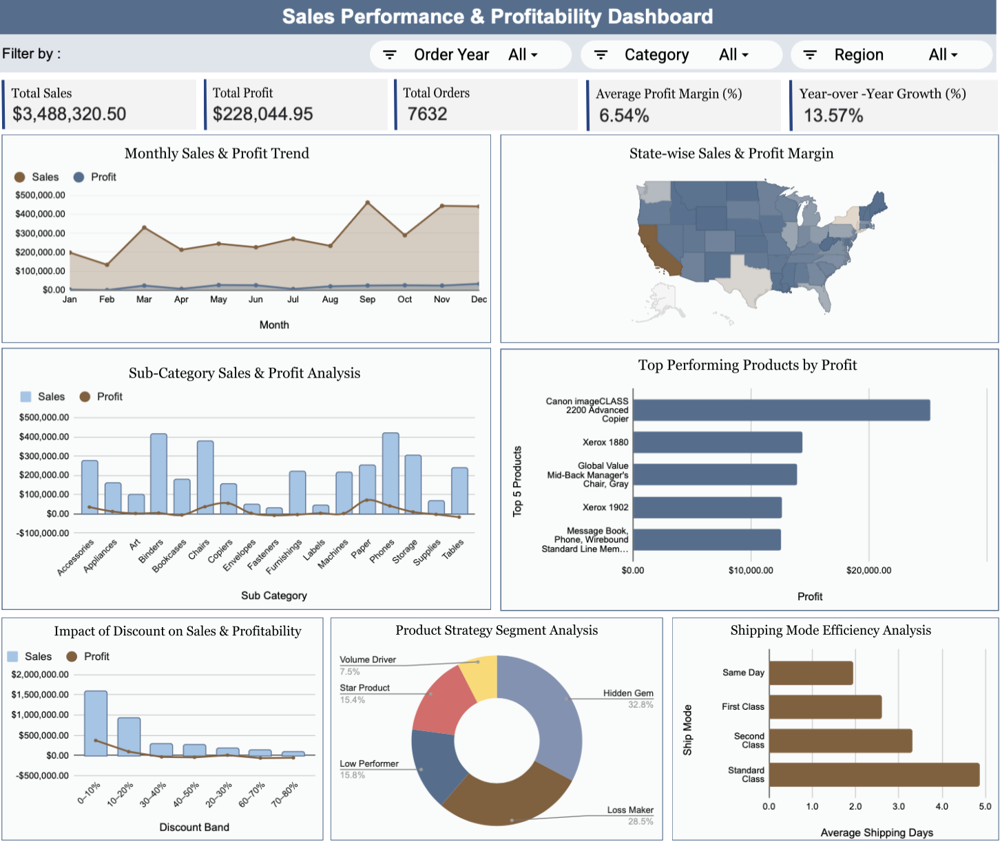
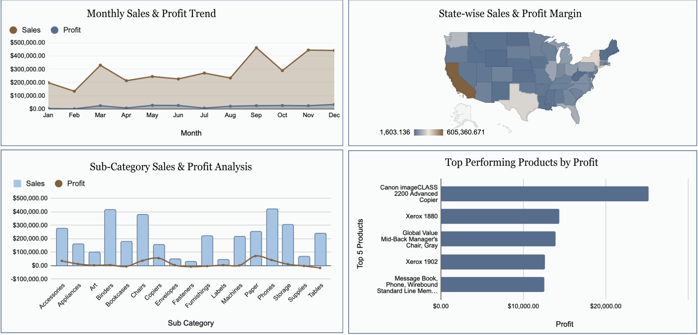
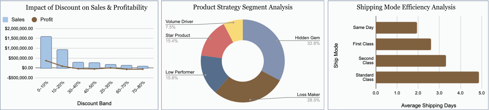
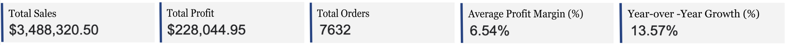

,
<div align="center">

# 🛒 Superstore Sales Performance & Profitability Analysis

### *Transforming Raw Retail Data into Profit Intelligence*


<br/>

> 💡 **"Revenue tells you what happened. Profit tells you if it mattered."**
> This project shifts the analytical lens from revenue tracking to **sustainable profit optimization.**

<br/>

| 💰 Total Sales | 📈 Total Profit | 📋 Total Orders | 📉 Profit Margin | ❌ Loss Transactions |
|:-:|:-:|:-:|:-:|:-:|
| **$3,488,320** | **$228,045** | **7,632** | **6.54%** | **3,157** |

</div>

---

## 📋 Table of Contents

- [📌 Project Overview](#-project-overview)
- [📁 File Details](#-file-details)
- [📊 Dataset Analysis Screenshots](#-dataset-analysis-screenshots)
- [📖 Data Dictionary](#-data-dictionary)
- [🔍 Key Insights & Statistics](#-key-insights--statistics)
- [💡 Analysis Suggestions](#-analysis-suggestions)
- [🧹 Data Cleaning Notes](#-data-cleaning-notes)
- [📈 Dashboard Summaries](#-dashboard-summaries)

---

## 📌 Project Overview

<table>
<tr>
<td width="50%" valign="top">

### 🎯 Problem Statement

The retail business generates **$3.49M** in revenue, yet profitability sits at only **6.54%**. Raw revenue growth masks critical issues:

- 📉 Discounts above 30% drive **negative margins** (as low as −66%)
- 🪑 Furniture runs at a critically thin **0.74% margin**
- 🗺️ South region earns just **$42K profit on $646K in sales**
- 📦 **3,157 transactions** actively lose the business **$330K**

Without structured analytics, revenue growth **conceals** these loss drivers.

</td>
<td width="50%" valign="top">

### 🛠️ Methodology

A structured **Retail Performance Analytics** model was built using:

- ✅ Multi-tab Google Sheets with raw & cleaned data
- ✅ **3 Analysis & Working tabs** covering KPIs, discount bands, and product segments
- ✅ Automated cleaning log (`Logs` sheet) for full traceability
- ✅ Postal code–based region mapping (`Region` tab)
- ✅ 7 derived columns engineered from raw fields
- ✅ Interactive slicer-based **executive dashboard**

</td>
</tr>
</table>

### 🎯 Project Scope

| ✅ **Included** | ❌ **Excluded** |
|---|---|
| Sales & profit KPI framework | Predictive / ML forecasting |
| Discount band impact analysis | Real-time data integration |
| Regional & category comparison | Customer demographic data |
| Product strategic segmentation | External economic factors |
| Shipping efficiency analysis | Cost of Goods Sold (COGS) |
| Year-over-year trend analysis | Marketing attribution data |

---

## 📁 File Details

```
📦 Superstore-Sales-Analysis/
│
├── 📊 Dashboard.xlsx               → Master workbook (8 tabs)
│   ├── 📋 RawDataset               → Original Kaggle data (12,617 rows × 19 cols)
│   ├── 🧹 CleanedDataset           → Cleaned & enriched data (12,617 rows × 25 cols)
│   ├── 📐 Analysis & Working 1     → KPI summary + State-wise pivot
│   ├── 📐 Analysis & Working 2     → Discount Band-wise Sales & Profit pivot
│   ├── 📐 Analysis & Working 3     → Product Segment-wise pivot
│   ├── 🖥️  Dashboard               → Final interactive executive dashboard
│   ├── 📝 Logs                     → Full data cleaning log (column-by-column)
│   └── 🗺️  Region                  → Postal code → Region mapping table (632 entries)
│
└── 📄 README.md                    → Project documentation (this file)
```

| Sheet | Rows | Columns | Purpose |
|---|---|---|---|
| `RawDataset` | 12,617 | 19 | Original unmodified Kaggle dataset |
| `CleanedDataset` | 12,617 | 25 | Cleaned data + 7 engineered columns |
| `Analysis & Working 1` | — | — | KPI totals + State-wise sales & profit margins |
| `Analysis & Working 2` | — | — | Discount band vs sales, profit & avg margin |
| `Analysis & Working 3` | — | — | Product segment vs sales, profit & quantity |
| `Dashboard` | — | — | Executive slicer dashboard (Year / Region / Category) |
| `Logs` | 19 columns reviewed | 4 cols | Column-level cleaning actions and outcomes |
| `Region` | 632 | 2 | Postal code lookup used to fill missing regions |

**🔗 Dataset Source:** [Superstore Sales – The Data Quality Challenge (Kaggle)](https://www.kaggle.com/datasets/dataobsession/superstore-sales-the-data-quality-challenge)

---

## 📊 Dashboard Images

### 1️⃣ Complete Dashboard



---

### 2️⃣ Sales & Profit Performance Analysis

**Includes:**
- Month Sales & Profit Trend
- Sub-Category Sales & Profit Analysis
- State-wise Sales and Profit Margin
- Top 5 Performing Products



---

### 3️⃣ Strategy & Operations Analysis

**Includes:**
- Impact of Discount
- Product Strategy Segment
- Shipping Mode



---

## 📖 Data Dictionary

### 📌 Raw Dataset — Original Columns (19 Columns)

| # | Column Name | Data Type | Description | Raw Issues |
|---|---|---|---|---|
| 1 | `Order ID` | Text | Unique order identifier | None |
| 2 | `Order Date` | Date | Date customer placed the order | Stored as text → converted |
| 3 | `Ship Date` | Date | Date order was shipped | Stored as text → converted |
| 4 | `Ship Mode` | Categorical | Same Day / First Class / Second Class / Standard Class | None |
| 5 | `Customer ID` | Text | Unique customer identifier | None |
| 6 | `Country` | Text | Country of delivery | None |
| 7 | `City` | Text | City of delivery | None |
| 8 | `State` | Text | State of delivery | None |
| 9 | `Postal Code` | Integer | Delivery postal code | None |
| 10 | `Region` | Categorical | West / East / Central / South | **638 missing** → filled via postal lookup |
| 11 | `Product ID` | Text | Unique product identifier | None |
| 12 | `Category` | Categorical | Furniture / Office Supplies / Technology | Inconsistent names (e.g. "Furni") → fixed |
| 13 | `Sub-Category` | Categorical | Detailed product type (Chairs, Phones, Paper…) | None |
| 14 | `Product Name` | Text | Full product description | None |
| 15 | `Sales` | Float | Revenue after discount | Format inconsistency → standardized |
| 16 | `Quantity` | Integer | Units sold | None |
| 17 | `Discount` | Float | Discount rate applied (0.0–1.0) | **910 missing** → replaced with 0 |
| 18 | `Profit` | Float | Net profit after costs | **882 missing** + text-formatted → cleaned |

> ℹ️ `Row ID` (column 19) was **removed** during cleaning — it holds no analytical value.

---

### 🔧 Cleaned Dataset — 7 Engineered Columns

| Derived Column | Source Fields | Formula / Logic | Purpose |
|---|---|---|---|
| `Order Month` | `Order Date` | `=TEXT(Order Date,"MMMM")` | Monthly trend analysis |
| `Order Year` | `Order Date` | `=YEAR(Order Date)` | YoY growth comparison |
| `Shipping Days` | `Ship Date`, `Order Date` | `=Ship Date − Order Date` | Delivery speed KPI |
| `Profit Margin %` | `Profit`, `Sales` | `=Profit / Sales` | Standardized profitability metric |
| `Profit Margin Category` | `Profit Margin %` | Conditional bucketing → Low / Medium / High | Segment-level comparison |
| `Discount Band` | `Discount` | Grouped into 10% ranges (0–10%, 10–20%…80%) | Discount impact analysis |
| `Product Segment` | `Sales`, `Profit` | Multi-condition classification (see below) | Strategic portfolio management |

---

### 🗂️ Product Segment Classification

| Segment | Criteria | Count in Dataset |
|---|---|---|
| ⭐ **Star Product** | High Sales + High Profit | 1,597 |
| 💎 **Hidden Gem** | Lower Sales + High Profit Margin | 6,208 |
| 📦 **Volume Driver** | High Sales + Thin Margin | 531 |
| 🔻 **Low Performer** | Low Sales + Near-zero Profit | 1,124 |
| ❌ **Loss Maker** | Negative Profit | 3,157 |

---

## 🔍 Key Insights & Statistics

---

**1. 📉 Thin Margin Despite $3.49M Revenue**
Total sales of $3,488,320 produce only $228,045 in profit — a **6.54% margin**. Revenue growth has been consistently masking a profitability problem.

---

**2. ✂️ Discounting is the #1 Profit Killer**
Once discounts exceed 30%, every transaction runs at a loss. At 70–80% discounts, the business loses **66 cents per dollar of revenue**. These bands collectively destroy hundreds of thousands in profit.

| Band | Transactions | Net Profit | Verdict |
|---|---|---|---|
| 0–10% | 5,840 | **+$371,315** | ✅ Core earner |
| 30–40% | 650 | **−$38,523** | 🔴 Losing |
| 60–70% | 595 | **−$67,936** | 🔴 Destroying value |
| 70–80% | 471 | **−$60,307** | 🔴 Critical |

---

**3. 🪑 Furniture is a Margin Desert**
Furniture generates $1,011,565 in revenue but only **$7,463 in profit (0.74% margin)** — nearly the entire category is effectively break-even or loss-making (44% of products unprofitable).

---

**4. ❌ 3,157 Transactions Actively Destroy $330K**
Loss Maker transactions bring in $1.03M in sales but erase it with $330,655 in losses — a **−32% effective margin** on that segment alone.

---

**5. 🏆 West Region = 37.2% of All Company Profit**
West delivers $84,802 (37.2% of total profit) from $1.03M in sales. South by comparison earns only $42,499 from $646K in sales — nearly the same revenue but far less efficiency.

---

**6. 💻 Technology Margin is 16× Furniture's**
Technology: **12.30% margin.** Furniture: **0.74% margin.** Shifting even 10% of Furniture revenue toward Technology could materially improve overall company margins.

---

**7. ⭐ 1,597 Star Transactions Fund the Entire Business**
Star Products generate **+$377,260** in profit — exceeding the company's total profit of $228K. They are essentially subsidizing the losses generated by Loss Makers.

---

**8. 📅 Sep–Dec Is Everything**
The top 3 sales months — September ($462K), November ($444K), December ($441K) — represent nearly **38% of annual revenue**. The bottom 6 months average just ~$160K/month.

---

**9. 🚚 Shipping Mode Distribution**

| Ship Mode | Orders | Avg Days |
|---|---|---|
| Same Day | 1,182 | 1.93 days |
| First Class | 2,200 | 2.59 days |
| Second Class | 2,616 | 3.29 days |
| Standard Class | 6,619 | **4.85 days** |

Standard Class handles 52.5% of all orders. Assessing the cost-vs-speed trade-off could unlock shipping savings.

---

**10. 🏅 Top Sub-Categories by Margin**

| Sub-Category | Margin % |
|---|---|
| 🥇 Copiers | **35.04%** |
| 🥈 Paper | **27.83%** |
| 🥉 Accessories | 12.50% |
| ⚠️ Binders | 0.84% |
| ❌ Tables | (Negative) |

---

**11. 📉 2017 Margin Divergence Alert**
Sales hit their highest point in 2017 ($1.03M), but margin fell to **5.37%** — down from 8.36% in 2015. Revenue is growing while profit efficiency is shrinking.

---

## 💡 Analysis Suggestions

**📌 1. Hard Discount Cap Simulation**
Use the `Analysis & Working 2` pivot to model: *"If all discounts are capped at 20%, what is the net profit impact?"* The data shows that 0–20% bands collectively generate $463K+ in profit — while 30%+ collectively destroy $240K+.

**📌 2. Furniture Sub-Category Surgery**
Within Furniture's 0.74% margin, drill into Tables, Bookcases, and Supplies individually. Some sub-categories are likely viable while others drag the whole category down. Target elimination is more effective than a category-wide strategy.

**📌 3. West → South Operational Benchmarking**
Extract the Top 20 SKUs, discount rates, and ship modes in the West and directly compare to the South's product mix. The gap may be pricing, product selection, or logistics — the data can reveal which.

**📌 4. Star Product Replication Model**
The 1,597 Star Product transactions are the profit foundation. Analyze their region, category, customer, and discount level distribution to understand what drives their success — then build a framework to replicate it.

**📌 5. Loss Maker Elimination Simulation**
Model the impact of eliminating the bottom 500–1,000 Loss Maker SKUs. The question: does the revenue loss ($1.03M × partial) outweigh the $330K recovered in profit? The margin math likely says yes.

**📌 6. Seasonal Inventory & Promo Calendar**
Build a month-by-month plan using the monthly sales breakdown: ramp up inventory and marketing for Sep–Dec, and use the slower months (Jan–Apr) for clearance of low-margin stock.

**📌 7. Shipping Cost vs Order Value Filter**
Identify low-value orders shipped via First Class or Same Day — these represent high operational cost relative to the transaction size and may be compressing margins invisibly.

**📌 8. YoY Margin Decline Root Cause**
Sales grew by ~39% from 2014 to 2017, but margins peaked in 2015 and have declined since. Investigate whether this correlates with increasing discount usage, category mix shifts, or rising operational costs.

---

## 🧹 Data Cleaning Notes

> All cleaning was performed in Google Sheets and is fully documented in the `Logs` tab of `Dashboard.xlsx`.

### 📋 Column-Level Cleaning Log (from the `Logs` Sheet)

| Column | Issue Found | Action Taken | Result |
|---|---|---|---|
| `Row ID` | No analytical value | ❌ Column removed | Cleaner, leaner dataset |
| `Order ID` | No missing values | ✅ No action needed | All records complete |
| `Order Date` | Stored as text, inconsistent format | Converted to proper date format | Dates consistent |
| `Ship Date` | Stored as text | Converted to proper date format | Shipping dates correct |
| `Ship Mode` | No missing values | ✅ No action needed | Consistent |
| `Customer ID` | No missing values | ✅ No action needed | Valid |
| `Country` | No missing values | ✅ No action needed | Complete |
| `City` | No missing values | ✅ No action needed | Complete |
| `State` | No missing values | ✅ No action needed | Complete |
| `Postal Code` | No missing values | ✅ No action needed | Consistent |
| `Region` | **638 missing values** | Filled using `Region` tab postal code mapping (632 records) | All regions assigned |
| `Product ID` | No missing values | ✅ No action needed | Complete |
| `Category` | Inconsistent naming ("Furni", "OfficeSupply") | Standardized all labels | Uniform naming across dataset |
| `Sub-Category` | No missing values | ✅ No action needed | Consistent |
| `Product Name` | No missing values | ✅ No action needed | Valid |
| `Sales` | Format inconsistency | Standardized to numeric currency format | Values clear and comparable |
| `Quantity` | No missing values | ✅ No action needed | Correct |
| `Discount` | **910 missing values** | Replaced with `0` (no discount applied) | No missing discounts |
| `Profit` | **882 missing** + text-formatted entries | Converted to numeric; cleaned invalid entries | Profit column fully accurate |

---

### 🔧 Derived Columns — How They Were Built

| Column | Source | Method |
|---|---|---|
| `Order Month` | `Order Date` | `TEXT()` formula extracting full month name |
| `Order Year` | `Order Date` | `YEAR()` formula |
| `Shipping Days` | `Ship Date`, `Order Date` | Date subtraction formula |
| `Profit Margin %` | `Profit`, `Sales` | `= Profit / Sales` (48 nulls where Sales = 0) |
| `Profit Margin Category` | `Profit Margin %` | IF logic bucketing → Low / Medium / High |
| `Product Segment` | `Sales`, `Profit` | Multi-condition IF formula across 5 classes |
| `Discount Band` | `Discount` | Grouped into 10-percentage-point ranges |

---

### ⚠️ Key Cleaning Decisions

- **Negative profits were retained** — they represent real business losses, not errors, and are central to the discount and segment analysis
- **High discounts (40–80%) were retained** — verified as real, important for distribution analysis
- **Zero rows were deleted** — all 12,617 records from raw are preserved in cleaned data
- **`Profit Margin %` has 48 null values** — where Sales = 0, division is undefined; these are excluded from margin calculations only
- **Region was filled via lookup**, not imputation — the `Region` tab provides a verified postal code → region mapping for the 638 missing entries

---

## 📈 Dashboard Summaries

The executive dashboard in the `Dashboard` tab was built in **Google Sheets** using pivot tables, formulas, and dynamic slicers.

---

### 🎛️ Dynamic Slicers (Filters)

| Slicer | Options | Effect |
|---|---|---|
| 📅 **Year** | 2014 / 2015 / 2016 / 2017 | All KPIs and charts update |
| 🗺️ **Region** | West / East / Central / South | Drill into regional performance |
| 🏷️ **Category** | Furniture / Office Supplies / Technology | Filter by product type |

All KPI cards, charts, and pivot summaries update **automatically** on slicer selection.

---

### 🖥️ Section 1 — Executive KPI View *(Analysis & Working 1)*

| KPI | Value | Formula Used |
|---|---|---|
| 💰 Total Sales | $3,488,320 | `=SUM(Sales)` |
| 📈 Total Profit | $228,045 | `=SUM(Profit)` |
| 📋 Total Orders | 7,632 | `=COUNTA(UNIQUE(Order ID))` |
| 📉 Profit Margin % | 6.54% | `=Total Profit / Total Sales` |
| ⏱️ Avg Shipping Days | 3.86 days | `=AVERAGE(Shipping Days)` |



---

### 🗺️ Section 2 — Regional & Category Analysis *(Dashboard)*

**Regional Performance:**
- 🏆 **West** leads: $84,802 profit, 8.24% margin — the regional benchmark
- ⚠️ **South** lags: $42,499 profit on $646K sales (6.58% margin, far below West's efficiency)
- **Central & East** perform at moderate, comparable levels

**Category Performance:**
- 💻 **Technology** — 12.30% margin → highest-performing, most efficient category
- 🗂️ **Office Supplies** — 6.35% margin → aligned with the business average
- 🪑 **Furniture** — 0.74% margin → near-zero profit on over $1M in revenue

> 📎 *[Insert Regional & Category Chart screenshot here]*

---

### ✂️ Section 3 — Discount & Product Segmentation *(Analysis & Working 2 & 3)*

**Discount Zone Summary:**

| Zone | Bands | Avg Margin | Action Required |
|---|---|---|---|
| ✅ Safe | 0–20% | +10% to +23% | Maintain; encourage |
| ⚠️ Caution | 20–30% | +3.1% | Cap immediately |
| 🔴 Danger | 30%+ | −14% to −66% | Require approval or eliminate |

**Product Segment Summary:**

| Segment | Txn Count | Revenue | Profit |
|---|---|---|---|
| ⭐ Star Products | 1,597 | $1,429,486 | **+$377,260** |
| 💎 Hidden Gems | 6,208 | $365,283 | **+$171,469** |
| 📦 Volume Drivers | 531 | $588,946 | **+$8,622** |
| 🔻 Low Performers | 1,124 | $73,640 | **+$1,349** |
| ❌ Loss Makers | 3,157 | $1,030,965 | **−$330,655** |

> 📎 *[Insert Discount & Segmentation screenshot here]*

---

### 📊 Section 4 — Trend Analysis

**Top Monthly Sales Periods:**

| Rank | Month | Total Sales |
|---|---|---|
| 🥇 1 | September | $462,050 |
| 🥈 2 | November | $444,142 |
| 🥉 3 | December | $441,155 |
| 4 | March | $329,957 |
| 5 | October | $289,447 |

**Year-over-Year Summary:**

| Year | Sales | Profit | Margin |
|---|---|---|---|
| 2014 | $743,249 | $36,414 | 4.90% |
| 2015 | $800,988 | $67,001 | **8.36% ↑ Peak** |
| 2016 | $910,271 | $69,102 | 7.59% |
| 2017 | $1,033,812 | $55,528 | **5.37% ↓** |

> ⚠️ Revenue is growing — but margin has been **declining since 2015**. This divergence signals increasing discount pressure and mix shifts.

> 📎 *[Insert YoY Trend Chart screenshot here]*

---

### 🚀 Recommendations & Impact

| Recommendation | Estimated Impact |
|---|---|
| Cap all discounts at ≤20% | Eliminate most of −$240K in high-discount losses |
| Remove bottom Loss Maker SKUs | Recover estimated $50K–$80K in margin |
| Shift product mix toward Technology | +0.5–1 percentage point in overall margin |
| Benchmark South operations to West | Potential $15K–$25K additional profit |
| Align promotions to peak season (Sep–Nov) | Higher return per promotional dollar |

> 📊 **Estimated total margin improvement potential: +2 to +4 percentage points**

---

<div align="center">


**Institute:** Newton School of Technology &nbsp;|&nbsp; **Faculty Mentor:** Archit Raj

---

*📅 Capstone Project — Data Visualization Analysis | Newton School of Technology*


</div>